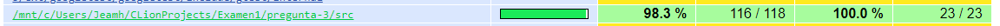
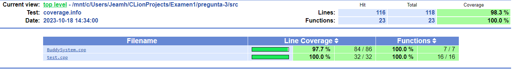
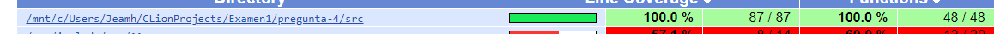
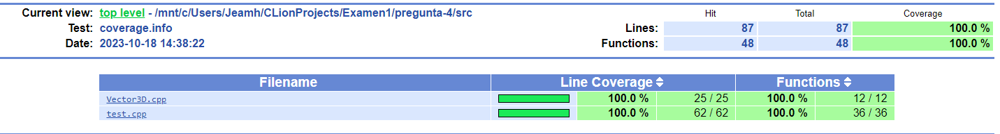
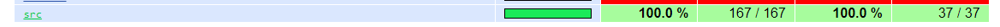
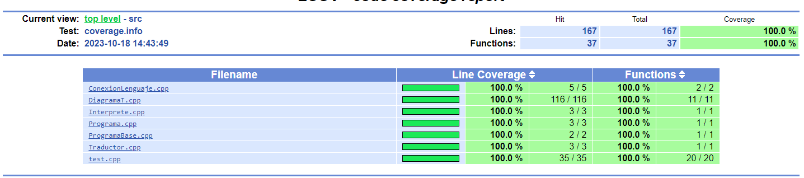

# EXAMEN 1 - CI3641

### Jeamhowards Montiel - 1910234

## Lenguaje y Herramientas Utilizados

Para la primera pregunta fue utilizado el lenguaje de programación Java, y para las tercera, cuarta y quinta pregunta fue utilizado el lenguaje de programación C++.

## Codigos fuentes

Para cada pregunta, su codigo fuente se encuentra en dentro de su carpeta correspondiente en la carpeta src. Por ejemplo, para la pregunta 3 el código fuente está en

```
./pregunta-3/src
```

## Como ejecutar el programa

### Primera Pregunta (Java)

1. Escribe en tu consola la palabra

```
make run
```
### Tercera Pregunta (C++)

1. Escribe en tu consola la palabra

```
./pregunta-3/BuddySystem <cantidad_de_bloques_de_memoria>
```

Donde <cantidad_de_bloques_de_memoria> es un número entero positivo.

Puede acceder también a las pruebas unitarias de la tercera pregunta, para ello escriba en su consola la palabra

```
./pregunta-3/runUnitTests
```

Por último puede acceder al informe de cobertura de las pruebas unitarias, para ello abra en su navegador web el archivo

```
./pregunta-3/coverage-report/index.html
```

Se anexan imagenes del informe





### Cuarta Pregunta (C++)

1. Escribe en tu consola la palabra

```
./pregunta-4/vector3D
```

Donde <cantidad_de_bloques_de_memoria> es un número entero positivo.

Puede acceder también a las pruebas unitarias de la tercera pregunta, para ello escriba en su consola la palabra

```
./pregunta-4/runUnitTests
```

Por último puede acceder al informe de cobertura de las pruebas unitarias, para ello abra en su navegador web el archivo

```
./pregunta-4/coverage-report/index.html
```

Se anexan imagenes del informe





### Quinta Pregunta (C++)

1. Escribe en tu consola la palabra

```
./pregunta-5/DiagramaT
```

Donde <cantidad_de_bloques_de_memoria> es un número entero positivo.

Puede acceder también a las pruebas unitarias de la tercera pregunta, para ello escriba en su consola la palabra

```
./pregunta-5/runUnitTests
```

Por último puede acceder al informe de cobertura de las pruebas unitarias, para ello abra en su navegador web el archivo

```
./pregunta-5/coverage-report/index.html
```

Se anexan imagenes del informe





